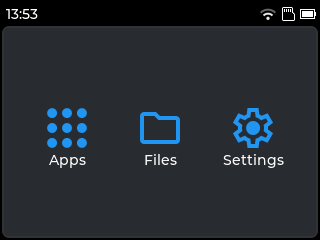
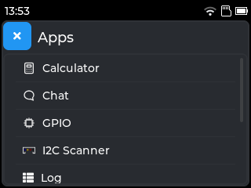
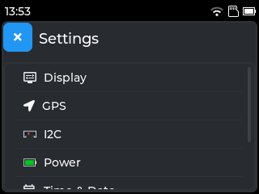

## Overview

Tactility is an operating system that focuses on the ESP32 microcontroller family.

See [https://tactility.one](https://tactility.one) for more information.

 | Board |
   | Hardware |

&nbsp;&nbsp;

You can run built-in apps or start them from an SD card. It's easy to manage system settings:

&nbsp;&nbsp;

## License

[GNU General Public License Version 3](LICENSE.md)
